# Beautiful Brains 
## Basic Guide

beautiful-brains is an visualization tool for presentations

Features:

 * Image registration (rigid and linear warp)
 * Mask images based on intensity or through skullstripping
 * Smooth images
 * Multi-slice panels
 * Easily automate png/jpeg creation

Future Features:

 * Template figures for QC checks and seeing your data
 * Intensity normalization

*Powered by [ANTsPy](https://antspy.readthedocs.io)*


```python
import beautiful_brains as bb
import inspect
```

### Define the path to your images


```python
MRI_PATH = 'MPRAGE.nii.gz'
PET_PATH = 'FBB.nii'
PET_DYNAMIC_PATH = 'FBB_dynamic.nii'

TEMPLATE_PATH = 'MNI152_T1_1mm.nii.gz'
```

### Here, we load the two nifti images into the BBImage 


```python
print(inspect.signature(bb.load))
```

    (path: 'str | Path', *, LUT: 'str | Path | None' = None, colormap: 'Any | None' = None, threshold: 'tuple[float, float] | None' = None, indices: 'Sequence[int] | str | None' = None, scale: 'float | None' = None, interp: 'Any | None' = None, sharpen: 'int | None' = None, bias_correction: 'bool' = False, debug: 'bool' = False) -> 'BBImage'


```python
MRI = bb.load(
  MRI_PATH,
  colormap="gray",
  interp='NEAREST',
  bias_correction=True,
  scale=1,
  sharpen=0,
  threshold=(100,1900)
)

PET = bb.load(
  PET_PATH,
  colormap="nih",
  interp='NEAREST',
  scale=1,
  sharpen=0,
  threshold=(100,10000)
)

PET_dynamic = bb.load(
  PET_DYNAMIC_PATH,
  colormap="nih",
  interp='NEAREST',
  scale=1,
  sharpen=0,
  threshold=(100,10000)
)
```


    ---------------------------------------------------------------------------

    ImageGeometryError                        Traceback (most recent call last)

    Cell In[8], line 20
         16   sharpen=0,
         17   threshold=(100,10000)
         18 )
         19 
    ---> 20 PET_dynamic = bb.load(
         21   PET_DYNAMIC_PATH,
         22   colormap="nih",
         23   interp='NEAREST',


    File ~/Documents/QC_images/beautiful-brains/src/beautiful_brains/image.py:566, in load(path, LUT, colormap, threshold, indices, scale, interp, sharpen, bias_correction, debug)
        563     return _load_bbi(path, debug=debug)
        565 _debug_print(debug, f"loading image: {path}")
    --> 566 volume = load_volume(path)
        567 _debug_print(debug, f"loaded image shape: {volume.data.shape}")
        568 parsed_indices = _parse_indices(indices)


    File ~/Documents/QC_images/beautiful-brains/src/beautiful_brains/io.py:52, in load_volume(path, canonical)
         50 data = np.asarray(image.get_fdata(dtype=np.float32))
         51 if data.ndim != 3:
    ---> 52     raise ImageGeometryError(f"Only 3D images are supported right now: {path}")
         53 return Volume(path=path, image=image, data=data, affine=np.asarray(image.affine))


    ImageGeometryError: Only 3D images are supported right now: FBB_dynamic.nii


## Transformations

First, I will register the PET to the MRI using rigid body transformation


```python
PET = bb.transform(source=PET, target=MRI, warp='Rigid')
```

Next, I'll warp the MRI to my template using 12 degrees of freedom


```python
MRI = bb.transform(source=MRI, target=TEMPLATE_PATH, warp='Affine')
```


```python
PET = bb.apply_transform(source=PET, matrix=MRI.transform_info)
```

I can then apply that transformation matrix to other images in the same space


```python
PET = bb.apply_transform(source=PET,matrix=MRI.transform_info)
```

## Metadata
This stores useful information about the image


```python
MRI.metadata()
```

    BBImage metadata
    name: MPRAGE.nii.gz
    path: MPRAGE.nii.gz
    kind: intensity
    volume:
      data: matrix shape=(208, 256, 256), dtype=float32
      affine: matrix shape=(4, 4), dtype=float64
      voxel_sizes: (1.0, 1.0, 1.0)
    display:
      scale: 1.0
      interp: NEAREST
      sharpen: 0
      colormap: gray
      LUT: None
      threshold: (100.0, 1900.0)
    indices: None
    crop_info: None
    mask: none
    transform:
      status: pending
      warp: Affine
      template: MNI152_T1_1mm.nii.gz
      forward_transforms: 1 file(s)
      inverse_transforms: 1 file(s)
      template_volume: data matrix shape=(182, 218, 182), dtype=float32, affine matrix shape=(4, 4), dtype=float64
      template_shape: (182, 218, 182)
      template_affine: matrix shape=(4, 4), dtype=float64


```python
print(PET.volume.path)
print(type(PET.volume.image))
print(type(PET.volume.data), PET.volume.data.shape)
print(type(PET.volume.affine), PET.volume.affine.shape)
```

    FBB.nii
    <class 'nibabel.nifti1.Nifti1Image'>
    <class 'numpy.ndarray'> (256, 256, 89)
    <class 'numpy.ndarray'> (4, 4)


## Reslicing

I want both images to have the same dimensions so that they can share a mask. This is not necessary. Reslice is its own function so that you can transform the image multiple times without needing to interpolate the data multiple times. You can also choose to not reslice at all. the slice function will select the correct voxels based on the affine matrix, even if the logical slice is oblique to the 3 axes.

Here, I am going to choose LANCZOS interpolation which is visually pleasing.

I could also select NEAREST and BICUBIC


```python
PET = PET.reslice(interp='LANCZOS')
MRI = MRI.reslice(interp='LANCZOS')
```

I can take a slice of my images to see what they look like

I changed the scale here because I wanted small pictures of the data. It is recommended to upscale 2x or 3x when making figures which improves visualization.


```python
MRI.scale=1
MRI.slice(80)
```


    
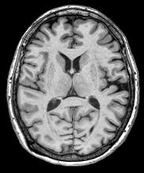
    


```python
PET.scale=1
PET.colormap = bb.colormaps.as_listed_colormap('nih')
PET.slice(80)
```


    
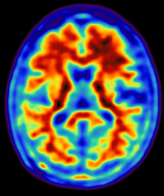
    


```python
PET.colormap = bb.colormaps.as_listed_colormap('soft-nih')
PET.slice(80)
```


    

    


## Masking

I have two options to create masks

bb.create_mask 
bb.create_brainmask

The former masks the entire image and the later masks the brain 

Both are powered by antspy


```python
mask = bb.create_mask(
  source=MRI,
  pad=4,
  cleanup=0,
)
```


```python
MRI.mask = mask
MRI.slice(80)
```


    

    


Here is why I chose to reslice the PET image. Now I can use the same mask for the PET as I made for the MRI.


```python
PET.mask = mask
```


```python
PET.slice(80)
```


    
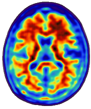
    


## Smoothing


```python
PET_smoo = bb.smooth_image(source=PET,kernel=(10,10,10))
```


```python
PET_smoo.scale=1
PET_smoo.slice(80)
```


    
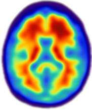
    


## Cropping / bounding box


```python
# Auto-crop or define the bounding box yourself
MRI = bb.crop(
  MRI,
  how="otsu",
  pad=0
)
```


```python
print(MRI.volume.data.shape)
print(MRI.crop_info)
```

    (182, 218, 182)
    ((0, 182), (7, 218), (0, 173))


```python
MRI.crop_info = ((20, 160), (20, 200), (0, 182))
```


```python
MRI.slice(80)
```


    
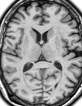
    


```python
# Resetting the crop
MRI.crop_info = ((0, 182), (0, 218), (0, 182))
```


```python
MRI.slice(80)
```


    
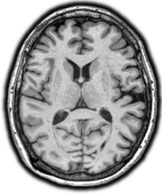
    


## Modifying visualization info

All the visualization metadata can be defined as such.

These values define how the slice function renders the image.


```python
MRI.colormap = (bb.colormaps.as_listed_colormap('grey'))
MRI.threshold = (0,1900)
```


```python
PET.colormap = (bb.colormaps.as_listed_colormap('nih'))
PET.threshold = (100,10000)
```


```python
MRI.interp='NEAREST'
MRI.scale=3
```


```python
MRI.sharpen=50
```


```python
PET.interp = 'NEAREST'
PET.scale=3
```

## Creating figure panels


```python
import numpy as np
Ratio = MRI.slice(120,'axial').size
fig = bb.bbfigure(
  size=1,
  grid=(5, 1),
  dpi=2400,
    box_ratio=(Ratio[0]/Ratio[1]),
  background=(0, 0, 0, 0),
)
for i,slice_i in enumerate(np.round(np.linspace(50,100,5),0)):
    fig[i, 0] = MRI.slice(int(slice_i), "axial",alpha=1)
img = fig.render()
img.save('./beautiful-brains/figures/5x1_MRI_axial.png')
img
```


    
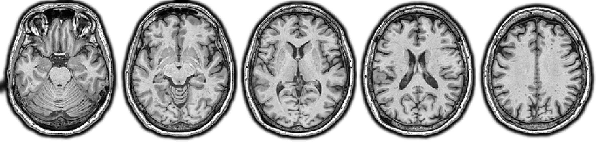
    


```python
Ratio = MRI.slice(120,'axial').size
fig = bb.bbfigure(
  size=1,
  grid=(5, 1),
  dpi=2400,
    box_ratio=(Ratio[0]/Ratio[1]),
  background=(0, 0, 0, 0),
)
for i,slice_i in enumerate(np.round(np.linspace(50,100,5),0)):
    fig[i, 0] = PET.slice(int(slice_i), "axial",alpha=1)
img = fig.render()
img.save('./beautiful-brains/figures/5x1_PET_axial.png')
img
```


    
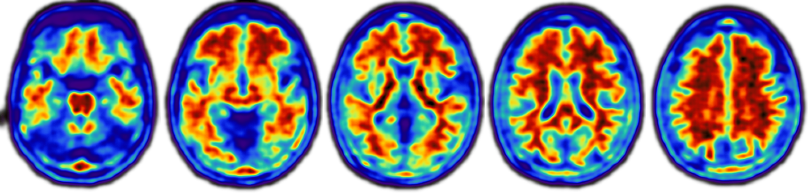
    


## Overlaying PET on MRI


```python
Ratio = MRI.slice(120,'axial').size
fig = bb.bbfigure(
  size=1,
  grid=(5, 1),
  dpi=2400,
    box_ratio=(Ratio[0]/Ratio[1]),
  background=(0, 0, 0, 0),
)
for i,slice_i in enumerate(np.round(np.linspace(50,100,5),0)):
    fig[i, 0] = MRI.slice(int(slice_i), "axial")
    fig[i, 0].append(PET.slice(int(slice_i), "axial",alpha=.55))
img = fig.render()
img.save('./beautiful-brains/figures/5x1_MRI_PET_axial.png')
img
```


    

    


```python
Ratio = MRI.slice(120,'coronal').size
fig = bb.bbfigure(
  size=1,
  grid=(5, 1),
  dpi=2400,
    box_ratio=(Ratio[0]/Ratio[1]),
  background=(0, 0, 0, 0),
)
for i,slice_i in enumerate(np.round(np.linspace(70,140,5)[::-1],0)):
    fig[i, 0] = MRI.slice(int(slice_i), "coronal")
    fig[i, 0].append(PET.slice(int(slice_i), "coronal",alpha=.55))
img = fig.render()
img.save('./beautiful-brains/figures/5x1_MRI_PET_coronal.png')
img
```


    
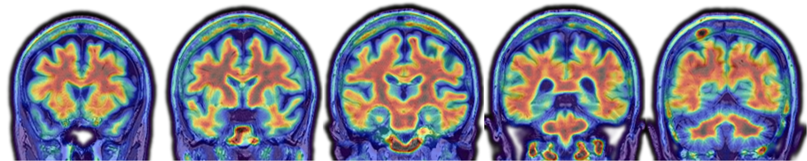
    


```python

```


```python
Ratio = MRI.slice(120,'axial').size
fig = bb.bbfigure(
  size=1,
  grid=(5, 2),
  dpi=2400,
    box_ratio=(Ratio[0]/Ratio[1]),
  background=(0, 0, 0, 0),
)
for i,slice_i in enumerate(np.round(np.linspace(50,100,5),0)):
    fig[i, 0] = MRI.slice(int(slice_i), "axial")
for i,slice_i in enumerate(np.round(np.linspace(50,100,5),0)[::1]):
    fig[i, 1] = (PET.slice(int(slice_i), "axial"))
img = fig.render()
img.save('./beautiful-brains/figures/5x2_MRI_PET_3.png')
```


```python
img
```


    
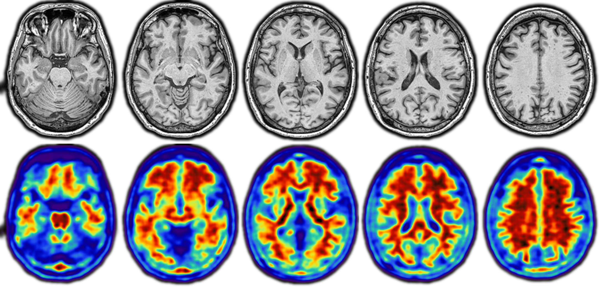
    


```python

```

### Create movies 


```python
print(inspect.signature(bb.make_video))
```

    (frames: 'Iterable[Any]', timing: 'float', filepath: 'str | Path') -> 'Path'


```python

```


    array([50, 51, 52, 53, 54, 55, 56, 57, 58, 59, 60, 61, 62, 63, 64, 65, 66,
           67, 68, 69, 70, 71, 72, 73, 74, 75, 76, 77, 78, 79, 80, 81, 82, 83,
           84, 85, 86, 87, 88, 89, 90, 91, 92, 93, 94, 95, 96, 97, 98, 99])


```python
slices[:-1:][::-1]
```


    array([99, 98, 97, 96, 95, 94, 93, 92, 91, 90, 89, 88, 87, 86, 85, 84, 83,
           82, 81, 80, 79, 78, 77, 76, 75, 74, 73, 72, 71, 70, 69, 68, 67, 66,
           65, 64, 63, 62, 61, 60, 59, 58, 57, 56, 55, 54, 53, 52, 51, 50])


```python
Ratio = PET.slice(120,'axial').size
slices = list(np.arange(50,101,1))
slices.extend(slices[:-1:][::-1])
time = 0.1
frames = []
for i,slice_i in enumerate(slices):
    fig = bb.bbfigure(
      size=3,
      grid=(1, 1),
      dpi=300,
        box_ratio=(Ratio[0]/Ratio[1]),
      background=(0, 0, 0, 0),
    )
    fig[0, 0] = PET.slice(int(slice_i), "axial")
    frames.append(fig)

bb.make_video(frames,time,'video.webp')
```


    PosixPath('video.webp')


### You can use any matplotlib ListedColormap or make your own


```python
type(PET.colormap)
```


    matplotlib.colors.ListedColormap


```python
bb.colorbar(colormap='nih', height=50, length=500)
```


    

    


```python
# 'soft' colormaps have a small transparent portion at low intensities
bb.colorbar(colormap='soft-nih', height=50, length=500)
```


    
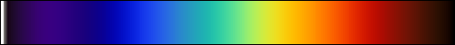
    


```python
bb.colorbar(colormap='gray', height=50, length=500)
```


    

    


```python
bb.colorbar(colormap='viridis', height=50, length=500)
```


    

    


```python
bb.colorbar(colormap='plasma', height=50, length=500)
```


    

    


```python
bb.colorbar(colormap='jet', height=50, length=500)
```


    
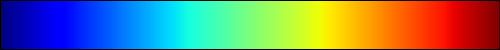
    


```python
bb.colorbar(colormap='hot', height=50, length=500)
```


    

    


```python
bb.colorbar(colormap='bone', height=50, length=500)
```


    

    


```python
bb.colorbar(colormap='copper', height=50, length=500)
```


    

    


