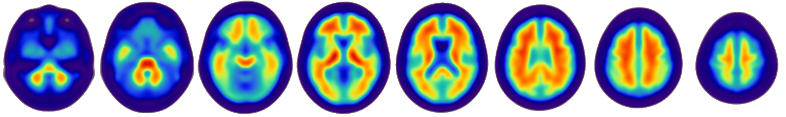

.. -*- rest -*-

.. vim:syntax=rst

.. Use raw locations for images so they render correctly on PyPI.

.. list-table::
   :widths: 20 60
   :header-rows: 0

   * - PyPI
     - .. image:: https://img.shields.io/pypi/v/beautiful-brains.svg
          :target: https://example.com/TODO/pypi
          :alt: PyPI version

   * - License & DOI
     - .. image:: https://img.shields.io/pypi/l/beautiful-brains.svg
          :target: LICENSE
          :alt: License

Beautiful-Brains creates notebook-friendly NIfTI figures from intensity images,
masks, and label maps.

Beautiful-Brains provides a Python toolkit for loading, smoothing, transforming, coregistering,
slicing, and compositing NifTy in Jupyter notebooks and Python
scripts. Images are read with `nibabel <https://nipy.org/nibabel/>`_, processed with `NumPy <https://numpy.org/>`_ and
`SciPy <https://scipy.org/>`_, and rendered with `Pillow <https://pillow.readthedocs.io/en/stable/>`_. Registration, masking, and bias-field correction is performed by ANTsPy.

Beautiful-Brains began as a series of personal utilities and scripts. 

To Do Before Beta Release
=========================

- ☑ Complete basic feature-set 
- ☑ Design starter templates
- ☐ Add documentation
- ☐ Set up PyPI
- ☐ Complete human code review  

AI Disclaimer
============

This project began as a set of human-coded utilities for private use. Claude Code (sonnet-4.6) and Codex (gpt-5.5) 
were used to convert a working codebase into a Python package. This prompt redesigned the code and built the entirety of the package as of the first Alpha release. Future development will continue using AI-based coding tools.

A requirement for all code merged into a stable release includes human review and testing.

Installation
============

To install Beautiful-Brains current release with ``pip``, run::

    pip install beautiful-brains

.. _current release: https://pypi.org/project/beautiful-brains/

Usage
=====

Support
=======

Please send questions, bug reports, and feature requests to the `issue tracker`_.

TODO: Documentation will be more thorough after releasing the code from Alpha

.. _issue tracker: https://github.com/Tj-Ward/beautiful-brains/issues

License
=======

Beautiful-Brains is licensed under the terms of the `GNU General Public License
version 3`_. For more information, please see the LICENSE_ file.

.. _LICENSE: https://github.com/Tj-Ward/beautiful-brains/blob/main/LICENSE
.. _GNU General Public License version 3: https://www.gnu.org/licenses/gpl-3.0.en.html
